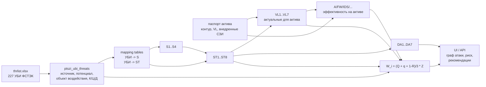

# ПТСЗИ CyberRisk: фактическая реализация и сопоставление с концептом

Готовая визуальная версия: `docs/concept-comparison/risk-calculation-scheme.html`.

## Главный вывод

Модель из PDF теперь выделена в отдельный контур ПТСЗИ и реализована как цепочка:

```text
Источник S
  -> каноническая угроза ST
  -> уязвимое звено VL
  -> метод противодействия
  -> деструктивное действие DA
  -> расчет W_i
  -> рекомендации
```

БДУ ФСТЭК не заменяет `ST1..ST8`. В проекте БДУ используется как доказательная и расчетная детализация: загружены 227 УБИ из файла ФСТЭК с объектом воздействия, последствиями по К/Ц/Д, источником угрозы и потенциалом нарушителя.

## Что реализовано в БД

| Блок | Реализация |
|---|---|
| Источники `S1..S4` | `ptszi_source_threats` |
| Угрозы `ST1..ST8` | `ptszi_threats` |
| Уязвимые звенья `VL1..VL7` | `ptszi_vulnerable_links` |
| Методы `A/FW/HP/DZ/IDS/AD/R/L/TE/DS/DD` | `ptszi_controls` |
| Деструктивные действия `DA1..DA7` | `ptszi_threat_destructive_actions` |
| Матрицы концепта | `ptszi_threat_vulnerable_links`, `ptszi_vulnerable_link_controls`, `ptszi_source_threats` |
| Паспорт актива | поля `assets` + `asset_vulnerable_links` + `asset_ptszi_controls` |
| УБИ ФСТЭК | `ptszi_ubi_threats`, 227 записей |
| Маппинг БДУ к концепту | `ptszi_ubi_source_mappings`, `ptszi_threat_ubi_links` |

Проверенный срез текущей базы:

```text
ptszi_ubi_threats: 227
ptszi_threat_ubi_links: 358
ptszi_ubi_source_mappings:
  S1 конкуренты: 83
  S2 недобросовестные партнеры: 83
  S3 персонал организации: 158
  S4 хакеры/мошенники: 174
```

## Канонические справочники концепта

### Источники угроз

| Код | Источник в PDF | Как сопоставляется с БДУ ФСТЭК |
|---|---|---|
| `S1` | Конкуренты | внешний нарушитель со средним/высоким потенциалом |
| `S2` | Недобросовестные партнеры | внешний нарушитель со средним/высоким потенциалом, когда нужен сценарий контрагента/делегированного доступа |
| `S3` | Персонал организации | любой внутренний нарушитель |
| `S4` | Хакеры, мошенники | внешний нарушитель; низкий потенциал только сюда, средний/высокий также сюда |

Причина такого сопоставления: в БДУ источник записан формально как `внешний/внутренний нарушитель + потенциал`, а в исходной схеме источники названы бизнес-ролями. Поэтому один источник БДУ может давать несколько источников концепта. Например, `Внешний нарушитель со средним потенциалом` маппится сразу на `S1`, `S2`, `S4`.

### Угрозы

| Код | Угроза |
|---|---|
| `ST1` | Инсталляция и запуск вирусов |
| `ST2` | Несанкционированный доступ |
| `ST3` | DDoS-атаки |
| `ST4` | Перехват трафика |
| `ST5` | Проникновение во внутреннюю сеть |
| `ST6` | Внешнее сканирование |
| `ST7` | Проникновение через сервисы |
| `ST8` | Спам, подмена сообщений/отправителя |

### Уязвимые звенья

| Код | Уязвимое звено |
|---|---|
| `VL1` | Нештатное дополнительное ПО: драйверы, утилиты |
| `VL2` | Устаревшие версии ПО или версии, имеющие уязвимости |
| `VL3` | Допустимость установки недекларируемого ПО |
| `VL4` | Возможность обхода правил и режимов безопасности администратором |
| `VL5` | Носители информации: флешки, жесткие диски |
| `VL6` | Открытые ОС |
| `VL7` | Отсутствие средств защиты ЛВС |

### Методы противодействия

| Код | Метод |
|---|---|
| `A` | Антивирус |
| `FW` | Межсетевой экран |
| `HP` | Honeypot |
| `DZ` | Демилитаризованная зона ЛВС |
| `IDS` | Система обнаружения вторжений |
| `AD` | Системы / настройки администрирования |
| `R` | Резервное копирование |
| `L` | Программная защита информации от НСД |
| `TE` | Шифрование трафика |
| `DS` | Цифровая подпись |
| `DD` | DDoS-фильтры |

## Схема фактической логики



## Формула W

```text
W_i = (Q_i_threat + q_i_threat + (1 - Q_i_reaction)) / 3 * Z
```

Где:

- `Q_i_threat` - степень реализации угрозы;
- `q_i_threat` - степень опасности угрозы;
- `Q_i_reaction` - насколько внедренные методы закрывают актуальные уязвимые звенья;
- `Z` - коэффициент контура: `1`, если угроза актуальна и для внешнего, и для внутреннего контура; иначе `0.5`.

Расчет `Qreaction`:

```text
actual_vls = ST_VL ∩ asset_VL
resulting_coverage = VL_control_coverage * asset_control_effectiveness
vl_coverage = 1 - product(1 - resulting_coverage)
Qreaction = avg(vl_coverage for actual_vls)
```

Смысл: угроза считается не сама по себе, а через пересечение уязвимых звеньев угрозы и конкретного актива. Если у актива нет нужного `VL`, сценарий не должен попадать в актуальные.

## Что конкретно дает БДУ ФСТЭК

В загруженной таблице УБИ используются поля:

| Поле БДУ | Что меняет в проекте |
|---|---|
| `Идентификатор УБИ` | дает ссылку на нормативную угрозу в отчете и UI |
| `Наименование`, `Описание` | показываются как примеры угроз внутри `ST` |
| `Источник угрозы` | маппится на `S1..S4` |
| `Объект воздействия` | показывает, на что направлена угроза: трафик, ПО, узел, данные, инфраструктура |
| `Нарушение конфиденциальности` | влияет на опасность `q_threat` |
| `Нарушение целостности` | влияет на опасность `q_threat` |
| `Нарушение доступности` | влияет на опасность `q_threat` |
| `потенциал нарушителя` | влияет на `Q_threat` |

Правило расчета из УБИ:

```text
low potential    -> Q_threat = 0.33
medium potential -> Q_threat = 0.66
high potential   -> Q_threat = 1.00

1 нарушенное свойство К/Ц/Д -> q_threat = 0.33
2 свойства                  -> q_threat = 0.66
3 свойства                  -> q_threat = 1.00
```

Сейчас эти значения загружены в `ptszi_ubi_threats`. Связи УБИ с `ST1..ST8` сохранены в `ptszi_threat_ubi_links`, а агрегированные `Q_threat` и `q_threat` для `ST` считаются как среднее по связанным УБИ.

## Пример 1: сопоставление источников

УБИ.001:

```text
Источник БДУ:
Внешний нарушитель со средним потенциалом;
Внутренний нарушитель со средним потенциалом
```

Маппинг:

| Фрагмент БДУ | Источник концепта |
|---|---|
| внешний, средний потенциал | `S1` конкуренты |
| внешний, средний потенциал | `S2` недобросовестные партнеры |
| внешний, средний потенциал | `S4` хакеры/мошенники |
| внутренний, средний потенциал | `S3` персонал организации |

Итог в UI/API: УБИ.001 отображается внутри сценариев с источниками `S1`, `S2`, `S3`, `S4`.

## Пример 2: БДУ меняет опасность угрозы

УБИ.002:

```text
Объект воздействия: Сетевой трафик
Последствия: нарушение конфиденциальности
Источник: внешний нарушитель со средним потенциалом
```

Вывод:

```text
Q_threat = 0.66
q_threat = 0.33
mapped_sources = S1, S2, S4
```

Эта УБИ усиливает сценарии вроде `ST4 Перехват трафика`: в отчете можно показать не абстрактную угрозу, а конкретную запись БДУ с объектом воздействия и нарушаемым свойством.

## Пример 3: расчет W по активу

Для демо-актива `Web Application Server` текущий API возвращает для одного из сценариев:

```text
ST2 = Несанкционированный доступ
actual_vls = VL2, VL6, VL7
Q_threat = 0.50
q_threat = 0.70
Qreaction = 0.73298
Z = 1.0
W = 0.48901
уровень = medium
```

Расчет:

```text
W = (0.50 + 0.70 + (1 - 0.73298)) / 3 * 1.0
W = 0.48901
```

Если добавить недостающие методы, например `A`, `L`, `R`, `DD`, `DZ`, `HP`, то `Qreaction` растет, а `W` падает. Это и есть практический смысл графа атаки: он показывает, какие звенья и методы реально влияют на остаточный риск.

## Где это смотреть в проекте

| Экран/API | Что показывает |
|---|---|
| `http://localhost:3000/ptszi/model` | новая рабочая страница ПТСЗИ: актив, VL, методы, сценарии, W, УБИ-примеры |
| `GET /api/ptszi/ubi` | 227 УБИ ФСТЭК с объектом воздействия, К/Ц/Д и источниками |
| `GET /api/ptszi/sources` | `S1..S4` |
| `GET /api/ptszi/assets/:assetID/threats` | применимые сценарии угроз для актива |
| `GET /api/ptszi/graph/:assetID/:threatID` | детализация одного сценария: S, ST, VL, методы, DA, УБИ, W |

## Что ставить рядом с листами PDF

| Лист концепта | Что поставить рядом |
|---|---|
| Источники и угрозы | Таблицу маппинга `внешний/внутренний нарушитель БДУ -> S1..S4` и срез `S -> ST` |
| Уязвимые звенья | Матрицу `ST -> VL` и пример, что УБИ/BDU подтверждает смысл конкретного сценария |
| Методы противодействия | Матрицу `VL -> A/FW/IDS/...` плюс текущие чекбоксы методов на странице ПТСЗИ |
| Деструктивные действия | Матрицу `ST -> DA` |
| Формула | Блок `actual_vls`, `Qreaction`, `Z`, `W` |
| Общий процесс | Схему `thrlist.xlsx -> УБИ -> S/ST -> актив/VL/СЗИ -> W -> рекомендации` |
